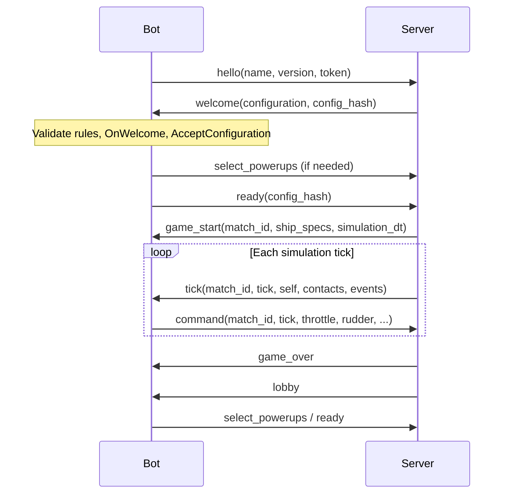

# Protocol and lifecycle

The port supports major protocol 3. Minor versions and unknown fields are accepted.
Both the welcome's top-level version and the acknowledged configuration's version
must be 3.x. Configuration parsing completes before replacing the previous rules.
An invalid update leaves the previously acknowledged snapshot intact.

The server may send a configuration update in the lobby, prompting another
`OnWelcome`, configuration decision, loadout decision, and acknowledgement.
Readiness always includes the exact server-provided hash. Invalid/refused loadouts
remain unready. Clearing a previously selected loadout requires the server's
`empty_loadout` capability. Between matches the server clears loadouts, so the
first empty selection in a new lobby requires no clearing message.

`game_start` can carry changed ship specs and dt; `OnWelcome` runs with those
values before the start callback. Commands echo the exact match ID and tick of
the corresponding observation. The runtime owns the receive loop and handles
fragmented text frames. Invalid JSON, non-object JSON, binary frames, and malformed
typed messages are ignored and counted; malformed individual events remain raw.

`simulation_dt` is fixed simulation seconds per tick. `tick_hz` controls wall-clock
pacing and can differ from `1 / simulation_dt`. Track velocity, lead calculations,
and splash prediction use simulation time.

Callback errors or invalid/nonfinite command values produce a hold command for
that tick. Unknown activation IDs are rejected locally; the server remains
authoritative for loadout membership, use state, cooldowns, and command deadlines.

Error codes `unauthorized`, `invalid_name`, `duplicate_name`, and `rate_limited`
are fatal for a connection. Other errors are counted and delivered to `OnError`.
Disconnect diagnostics retain the phase interrupted. Reconnects can retry lobby
connections, but never resume a running ship. Returning false from `OnGameOver`
ends participation; true allows multiple matches over one connection.
